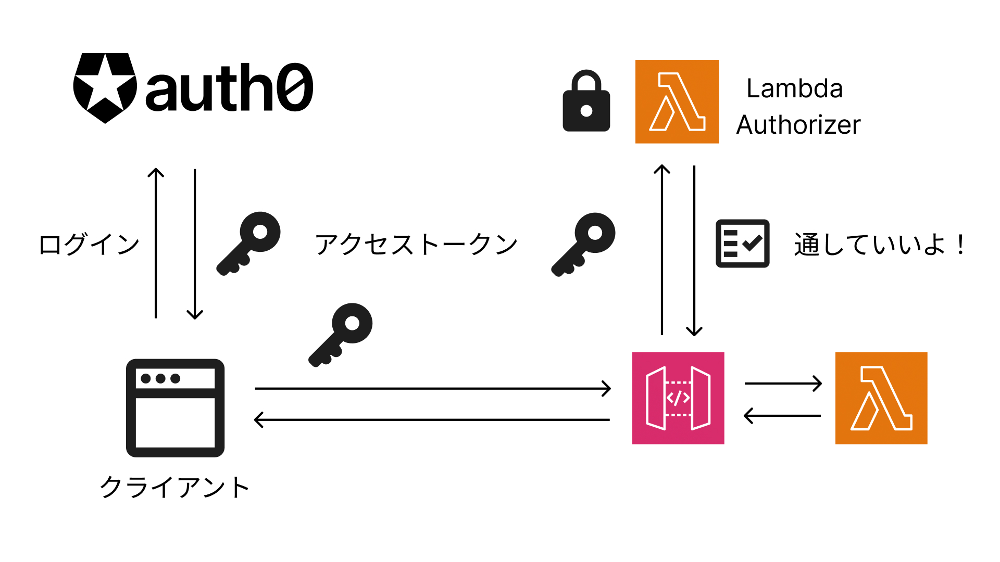

# 作業手順

- DynamoDBのテーブル作成（AWSマネコン）
- Application・API作成（Auth0）
- フロントアプリ（React）のDL
- AWS SAMでプロジェクト作成
- いいねAPIを作成
- **APIの認証・認可を作成**
- ゴールド会員の追加・削除

# 前提

下記インストール済みであること

- AWS CLI
  - [公式](https://docs.aws.amazon.com/ja_jp/cli/latest/userguide/getting-started-install.html)からインストーラーでインストール可能
- AWS SAM CLI
  - [公式](https://docs.aws.amazon.com/ja_jp/serverless-application-model/latest/developerguide/install-sam-cli.html)からインストーラーでインストール可能
- Node.js（動画ではv22.14.0）

# リソースの作成

下記をAWS・Auth0の画面で作成

- DynamoDB・テーブル（AWS）
- Application（Auth0）
- API（Auth0）
- permission・Role（Auth0）
- RBAC Settings
  - Enable RBAC
  - Add Permissions in the Access Token

# フロントアプリ（React）をDL

[こちら](https://github.com/JiroYoyogi/auth0-app/tree/3_express_api_permission_check)よりDL 

- domain
	- ApplicationのDomain
- clientId
	- ApplicationのClientID
- audienct
	- APIのIdentifie

# SAMプロジェクトをDL

- 右上「Code」よりDL

# いいねAPI

## 認証・認可

リソースへのアクセスの可否を書いたIAMポリシーをチェック関数から返す



## Allow

- authorizer.mjs

```js

export const lambdaHandler = async (event, context) => {
  // arn:aws:execute-api:region:account-id:api-id/stage/GET/items/*
  const methodArn = event.methodArn;
  // APIパスに対してAllowする
  return generatePolicy(methodArn, "Allow");
};

const generatePolicy = (methodArn, effect, principalId = "user") => {
  return {
    principalId, // Lambdaを誰が呼んだか
    policyDocument: {
      Version: "2012-10-17",
      Statement: [
        {
          Action: "execute-api:Invoke",
          Effect: effect,
          Resource: methodArn,
        },
      ],
    },
  };
};
```

## Deny

- authorizer.mjs

```js
export const lambdaHandler = async (event, context) => {
  // arn:aws:execute-api:region:account-id:api-id/stage/GET/items/*
  const methodArn = event.methodArn;
  // APIパスに対してDenyする
  return generatePolicy(methodArn, "Deny");
};

const generatePolicy = (methodArn, effect, principalId = "user") => {
  return {
    principalId, // Lambdaを誰が呼んだか
    policyDocument: {
      Version: "2012-10-17",
      Statement: [
        {
          Action: "execute-api:Invoke",
          Effect: effect,
          Resource: methodArn,
        },
      ],
    },
  };
};

```

## アクセストークンを検証する

- authorizer.mjs

https://auth0.com/blog/protecting-rest-apis-behind-aws-api-gateway/

```js
import { TextEncoder } from "util";
import crypto from "crypto";

const auth0Domain = process.env.AUTH0_DOMAIN;
// 公開鍵を取得
const jwks_doc = await fetch(`https://${auth0Domain}/.well-known/jwks.json`);
const jwks = await jwks_doc.json();

// Base64のDecode
const base64UrlDecode = (str) => {
  return Buffer.from(str, "base64").toString("utf8");
};

export const lambdaHandler = async (event, context) => {
  // arn:aws:execute-api:region:account-id:api-id/stage/GET/items/*
  const methodArn = event.methodArn;
  // アクセストークン取得
  const token = event.authorizationToken.split(" ")[1];
  if (!token) {
    return generatePolicy(methodArn, "Deny");
  }

  const [headerB64, payloadB64, signatureB64] = token.split(".");
  const header = JSON.parse(base64UrlDecode(headerB64));
  // 使用している鍵のID
  const kid = header.kid;
  // JWKsと照らして公開鍵を特定
  const key = jwks.keys.find((key) => key.kid === kid);
  if (!key) {
    return generatePolicy(methodArn, "Deny");
  }
  // 証明書から公開鍵を作成
  const publicKey = crypto.createPublicKey({
    key: `-----BEGIN CERTIFICATE-----\n${key.x5c[0]}\n-----END CERTIFICATE-----`,
    format: "pem",
  });
  const data = `${headerB64}.${payloadB64}`;
  const signature = Buffer.from(signatureB64, "base64");
  /**
   * 1. data を sha256 でハッシュ
   * 2. signature を publicKey で復号
   * 3. 両方を比較して、一致していれば true
   */
  const sig_valid = crypto.verify(
    // ★デジタル署名の検証を行う関数
    "sha256",
    new TextEncoder().encode(data), // ハッシュ対象のデータ、文字列 → バイト列
    publicKey, // 検証に使う公開鍵
    signature // 検証対象の署名
  );

  if (!sig_valid) {
    return generatePolicy(methodArn, "Deny");
  }

  const payload = JSON.parse(base64UrlDecode(payloadB64));
  console.log(payload);

  // authorized party Applications ClientID
  // APIを利用するクライアントアプリケーションのチェック
  const clientIdValid = payload["azp"] === process.env.OIDC_CLIENT_ID;

  if (!clientIdValid) {
    return generatePolicy(methodArn, "Deny");
  }

  if (payload["exp"] < new Date().getTime() / 1000) {
    return generatePolicy(methodArn, "Deny");
  }

  const httpMethod = methodArn.split("/")[2];
  const resourcePath = methodArn.split("/").slice(3).join("/");
  // いいねの取り消しの場合はpermissionsをチェックする
  if (resourcePath.startsWith("like") && httpMethod === "DELETE") {
    if(!payload["permissions"].includes("delete:like")) {
      return generatePolicy(methodArn, "Deny");
    }
  }

  return generatePolicy(methodArn, "Allow", payload.sub);
};

const generatePolicy = (methodArn, effect, principalId = "user") => {
  return {
    principalId, // Lambdaを誰が呼んだか
    policyDocument: {
      Version: "2012-10-17",
      Statement: [
        {
          Action: "execute-api:Invoke",
          Effect: effect,
          Resource: methodArn,
        },
      ],
    },
  };
};
```

# ゴールド会員になる / ゴールド会員を辞める

## リソースの作成

- M2M Application（Auth0）

## ドキュメントのURL

- [M2MアプリからシステムAPIを叩くためのアクセストークンを取得する](https://auth0.com/docs/secure/tokens/access-tokens/management-api-access-tokens/get-management-api-access-tokens-for-production)
- [ロールをユーザーに追加する](https://auth0.com/docs/api/management/v2/users/post-user-roles)
- [ロールをユーザーから削除する](https://auth0.com/docs/api/management/v2/users/delete-user-roles)

## コードの変更・追加

- template.yaml

パラメーター追加

```yaml
Parameters:
  DynamoTableName:
    Type: String
  DynamoKeyName:
    Type: String
  Auth0Domain:
    Type: String
  OIDCClientId: # React => API
    Type: String
  GoldMemberRoleId:
    Type: String
  M2MClientId: # Lambda => システムAPI
    Type: String
  M2MClientSecret:
    Type: String
```

Lambdaの環境変数追加

```yaml
Globals:
  Function:
    Timeout: 30
    Environment:
      Variables:
        DYNAMO_TABLE_NAME: !Ref DynamoTableName
        DYNAMO_KEY_NAME: !Ref DynamoKeyName
        AUTH0_DOMAIN: !Ref Auth0Domain
        OIDC_CLIENT_ID: !Ref OIDCClientId
        GOLD_MEMBER_ROLE_ID: !Ref GoldMemberRoleId
        M2M_CLIENT_ID: !Ref M2MClientId
        M2M_CLIENT_SECRET: !Ref M2MClientSecret
```


